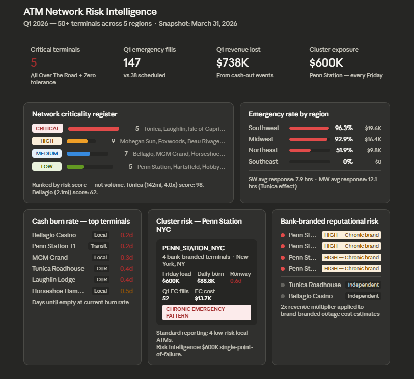
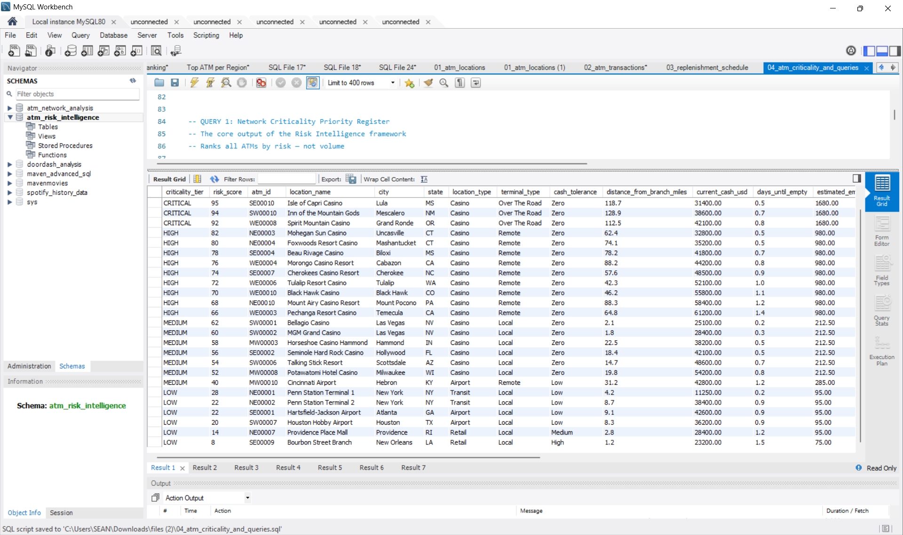
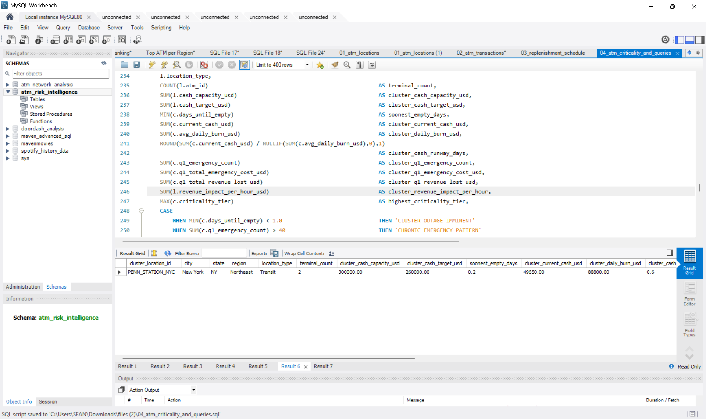
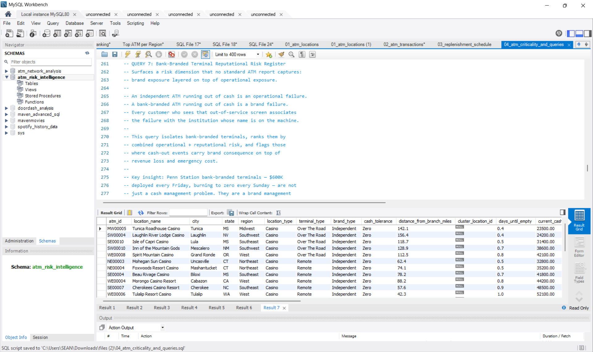

# ATM Network Risk Intelligence

**Operational risk framework for ATM cash management — built on the insight that volume is the wrong primary signal.**

---

## The Problem With Standard ATM Reporting

Most ATM dashboards answer one question: *where is withdrawal demand highest?*

That question produces useful reporting. It does not produce operational intelligence.

I know this because I spent years managing ATM networks. Every Sunday, I would log in and order emergency replenishments on terminals that standard reporting had no framework to prioritize correctly. Penn Station, New York — four Cardtronics terminals side by side, each loaded with $150,000 on Friday. All four would burn to zero by Sunday night. The reality was $600,000 in collective cash exposure burning down over 48 hours with Monday morning rush hour coming.

These were bank-branded terminals. That adds a layer of risk that pure cash management metrics never capture. A bank-branded ATM running out of cash is not just an operational failure — it is a brand failure. Every commuter who walks up to that machine on a Monday morning and sees an out-of-service screen associates that failure with the bank whose name is on it. Reputational consequence does not show up in a replenishment cost report. It does not appear in a transaction volume dashboard. But it is real, and it raises the stakes of every cash-out event significantly.

No standard dashboard flagged any of this. The operator had to know it.

**This project builds the framework that makes that knowledge explicit and scalable.**



---

## What Version 2 Established

[ATM Network Analysis — Version 2](https://github.com/SEANSKIDATA/ATM-Network-Analysis-Version-2) answered the volume question across a simulated national network:

- Which regions have the highest cash demand?
- Which terminals are exceeding their daily targets?
- Where should replenishment cycles be prioritized?

That work exposed the limitation. Volume tells you what already happened. It does not tell you what is about to go wrong — or how expensive it will be when it does.

---

## What Risk Intelligence Adds

This project introduces four variables that standard ATM reporting ignores entirely:

| Variable | Why It Matters |
|---|---|
| `terminal_type` — Local / Remote / Over The Road | Distance determines emergency response time and cost |
| `cash_tolerance` — Zero / Low / Medium / High | A casino cannot absorb even one hour of downtime |
| `emergency_multiplier` — 2.5x to 4.0x | An Over The Road emergency fill costs 4x a scheduled run |
| `days_until_empty` | Forward-looking runway, not backward-looking volume |

The result is a **Network Criticality Priority Register** — a ranked list of every ATM in the network ordered by operational consequence, not transaction count.

---

## The Core Insight

> A casino ATM 142 miles from the nearest branch with 0.4 days of cash remaining is a five-alarm emergency — regardless of how many transactions it processes.
>
> A high-volume urban transit ATM with 6 days of cash runway can wait.
>
> Standard reporting ranks them in the wrong order. This framework corrects that.

---

## Cluster Risk — A Concept Standard Reporting Misses Entirely

One of the most significant findings in this dataset involves terminal clustering.

**Penn Station, New York City — 4 co-located terminals:**

| Metric | Individual Terminal | Cluster (4 terminals) |
|---|---|---|
| Cash capacity | $150,000 | $600,000 |
| Friday load | $150,000 | $600,000 |
| Cash by Sunday night | ~$0 | ~$0 |
| Emergency fills Q1 | ~13 | ~52 |
| Criticality tier (individual) | MEDIUM | **CHRONIC EMERGENCY PATTERN** |

Standard reporting sees four separate local machines. Risk Intelligence sees a single-point-of-failure cluster deploying $600,000 every Friday and burning to zero every weekend.

The `cluster_location_id` field in `atm_locations` groups co-located terminals so Query 6 can surface this exposure explicitly.

---

## Dataset

**Scope:** 50+ ATMs across 5 regions — Northeast, Southeast, Midwest, Southwest, West
**Time period:** Q1 2026 — January 1 through March 31 (90-day time series)
**Granularity:** Daily transaction records + weekly summaries
**Platform:** MySQL

The dataset is purpose-built synthetic data designed to reflect realistic ATM network operating conditions including regional demand variance, location-type performance differences, distance-based replenishment economics, weekend vs weekday demand patterns, and cash target thresholds by location type.

*Synthetic data is disclosed here and throughout the project. The operational logic, cost structures, and risk variables are derived from real-world ATM network management experience.*

---

## Data Model

### `atm_locations` — Static Reference
Master ATM reference table. Every terminal's physical, operational, and risk profile.

Key fields: `terminal_type`, `cash_tolerance`, `distance_from_branch_miles`, `emergency_multiplier`, `revenue_impact_per_hour_usd`, `cluster_location_id`, `brand_type`

### `atm_transactions` — 90-Day Time Series
Daily transaction records for all 50+ ATMs across Q1 2026.

Key fields: `total_cash_dispensed_usd`, `opening_cash_usd`, `closing_cash_usd`, `replenishment_type`, `days_since_last_fill`, `is_weekend`

### `replenishment_schedule` — Cost Modeling
Every replenishment event — scheduled and emergency — with full cost breakdown.

Key fields: `replenishment_type`, `scheduled_cost_usd`, `actual_cost_usd`, `cost_variance_usd`, `emergency_multiplier`, `response_time_hours`, `revenue_lost_usd`

### `atm_criticality` — Derived Risk Scores
End-of-quarter snapshot. Composite risk scoring, criticality tier assignment, and recommended actions.

Key fields: `risk_score`, `criticality_tier`, `days_until_empty`, `avg_daily_burn_usd`, `q1_emergency_count`, `q1_total_emergency_cost_usd`, `q1_total_revenue_lost_usd`, `recommended_action`

---

## The 7 Core Queries

### Query 1 — Network Criticality Priority Register
The primary output of the framework. Every ATM ranked by risk score. Not by volume.



```sql
SELECT
    c.criticality_tier,
    c.risk_score,
    c.atm_id,
    l.location_name,
    l.city,
    l.state,
    l.location_type,
    c.terminal_type,
    c.cash_tolerance,
    c.distance_from_branch_miles,
    c.current_cash_usd,
    c.days_until_empty,
    c.estimated_emergency_cost_usd,
    c.revenue_impact_per_hour_usd,
    c.q1_emergency_count,
    c.q1_total_emergency_cost_usd,
    c.q1_total_revenue_lost_usd,
    c.recommended_action
FROM atm_criticality c
JOIN atm_locations l ON c.atm_id = l.atm_id
ORDER BY c.risk_score DESC, c.days_until_empty ASC;
```

---

### Query 2 — Over The Road Terminal Risk Summary
Isolates the highest-cost risk tier. Proves that distance x zero cash tolerance x emergency multiplier creates outsized operational exposure regardless of transaction count.

```sql
SELECT
    l.atm_id,
    l.location_name,
    l.city,
    l.state,
    l.distance_from_branch_miles,
    l.cash_tolerance,
    l.emergency_multiplier,
    c.days_until_empty,
    c.current_cash_usd,
    c.estimated_emergency_cost_usd,
    c.q1_emergency_count,
    c.q1_total_emergency_cost_usd,
    c.q1_total_revenue_lost_usd,
    ROUND(c.q1_total_emergency_cost_usd / NULLIF(c.q1_emergency_count,0), 2) AS avg_cost_per_emergency,
    c.risk_score
FROM atm_locations l
JOIN atm_criticality c ON l.atm_id = c.atm_id
WHERE l.terminal_type = 'Over The Road'
ORDER BY c.risk_score DESC;
```

---

### Query 3 — Emergency vs Scheduled Cost by Region
Quantifies the true cost of reactive cash management. Southwest region: 96.3% emergency rate, $252K in revenue lost, 7.9 hour average response time.

```sql
SELECT
    l.region,
    COUNT(r.replenishment_id)                                            AS total_replenishments,
    SUM(CASE WHEN r.replenishment_type = 'Scheduled' THEN 1 ELSE 0 END) AS scheduled_count,
    SUM(CASE WHEN r.replenishment_type = 'Emergency' THEN 1 ELSE 0 END) AS emergency_count,
    ROUND(SUM(CASE WHEN r.replenishment_type = 'Emergency' THEN 1 ELSE 0 END)
        / COUNT(r.replenishment_id) * 100, 1)                           AS emergency_rate_pct,
    SUM(r.scheduled_cost_usd)                                            AS total_scheduled_cost_usd,
    SUM(r.actual_cost_usd)                                               AS total_actual_cost_usd,
    SUM(r.cost_variance_usd)                                             AS total_emergency_premium_usd,
    SUM(r.revenue_lost_usd)                                              AS total_revenue_lost_usd,
    ROUND(AVG(r.response_time_hours), 1)                                 AS avg_response_time_hours
FROM replenishment_schedule r
JOIN atm_locations l ON r.atm_id = l.atm_id
GROUP BY l.region
ORDER BY total_emergency_premium_usd DESC;
```

---

### Query 4 — Cash Burn Rate vs Replenishment Frequency Gap
Forward-looking risk identification. Flags machines where burn rate is outpacing fill cycles before the outage happens.

```sql
SELECT
    l.atm_id,
    l.location_name,
    l.location_type,
    l.terminal_type,
    l.cash_tolerance,
    l.distance_from_branch_miles,
    c.avg_daily_burn_usd,
    c.current_cash_usd,
    c.days_until_empty,
    ROUND(c.current_cash_usd / NULLIF(c.avg_daily_burn_usd,0), 1)       AS cash_runway_days,
    c.q1_emergency_count,
    CASE
        WHEN c.days_until_empty < 1.0 AND l.cash_tolerance = 'Zero'     THEN 'OUTAGE RISK - ACT NOW'
        WHEN c.days_until_empty < 2.0 AND l.terminal_type IN
             ('Over The Road','Remote')                                   THEN 'HIGH BURN - SCHEDULE FILL'
        WHEN c.days_until_empty < 3.0                                    THEN 'MONITOR CLOSELY'
        ELSE 'WITHIN TOLERANCE'
    END                                                                   AS burn_rate_status,
    c.criticality_tier
FROM atm_criticality c
JOIN atm_locations l ON c.atm_id = l.atm_id
ORDER BY c.days_until_empty ASC, c.avg_daily_burn_usd DESC;
```

---

### Query 5 — 90-Day Transaction Trend with Day-of-Week Patterns
Surfaces weekend vs weekday demand splits by location type. Proves why casino and transit ATMs spike on weekends and why that spike creates predictable risk.

```sql
SELECT
    t.atm_id,
    l.location_name,
    l.location_type,
    l.terminal_type,
    l.cash_tolerance,
    COUNT(t.transaction_id)                                              AS total_records,
    SUM(t.total_withdrawals)                                             AS q1_total_withdrawals,
    SUM(t.total_cash_dispensed_usd)                                      AS q1_total_dispensed_usd,
    ROUND(AVG(t.total_cash_dispensed_usd), 2)                            AS avg_daily_dispensed_usd,
    SUM(CASE WHEN t.is_weekend = 1 THEN t.total_cash_dispensed_usd
             ELSE 0 END)                                                 AS weekend_dispensed_usd,
    SUM(CASE WHEN t.is_weekend = 0 THEN t.total_cash_dispensed_usd
             ELSE 0 END)                                                 AS weekday_dispensed_usd,
    ROUND(SUM(CASE WHEN t.is_weekend = 1 THEN t.total_cash_dispensed_usd ELSE 0 END)
        / NULLIF(SUM(t.total_cash_dispensed_usd),0) * 100, 1)           AS weekend_volume_pct
FROM atm_transactions t
JOIN atm_locations l ON t.atm_id = l.atm_id
GROUP BY t.atm_id, l.location_name, l.location_type,
         l.terminal_type, l.cash_tolerance
ORDER BY q1_total_dispensed_usd DESC;
```

---

### Query 6 — Cluster Risk Analysis
Groups co-located terminals by `cluster_location_id`. Surfaces the $600K Penn Station problem that individual-terminal reporting cannot see.



```sql
SELECT
    l.cluster_location_id,
    l.city,
    l.state,
    l.region,
    l.location_type,
    COUNT(l.atm_id)                                                      AS terminal_count,
    SUM(l.cash_capacity_usd)                                             AS cluster_cash_capacity_usd,
    MIN(c.days_until_empty)                                              AS soonest_empty_days,
    SUM(c.current_cash_usd)                                              AS cluster_current_cash_usd,
    SUM(c.avg_daily_burn_usd)                                            AS cluster_daily_burn_usd,
    ROUND(SUM(c.current_cash_usd) / NULLIF(SUM(c.avg_daily_burn_usd),0),1)
                                                                         AS cluster_cash_runway_days,
    SUM(c.q1_emergency_count)                                            AS cluster_q1_emergency_count,
    SUM(c.q1_total_emergency_cost_usd)                                   AS cluster_q1_emergency_cost_usd,
    SUM(c.q1_total_revenue_lost_usd)                                     AS cluster_q1_revenue_lost_usd,
    CASE
        WHEN MIN(c.days_until_empty) < 1.0                               THEN 'CLUSTER OUTAGE IMMINENT'
        WHEN SUM(c.q1_emergency_count) > 40                              THEN 'CHRONIC EMERGENCY PATTERN'
        WHEN SUM(c.q1_total_emergency_cost_usd) > 10000.00              THEN 'HIGH CLUSTER COST EXPOSURE'
        ELSE 'MONITOR'
    END                                                                   AS cluster_risk_flag
FROM atm_locations l
JOIN atm_criticality c ON l.atm_id = c.atm_id
WHERE l.cluster_location_id IS NOT NULL
GROUP BY l.cluster_location_id, l.city, l.state, l.region, l.location_type
ORDER BY cluster_q1_emergency_cost_usd DESC;
```

---

### Query 7 — Bank-Branded Terminal Reputational Risk Register
Introduces a risk dimension that no standard ATM report captures: brand exposure layered on top of operational exposure. An independent ATM running out of cash is an operational failure. A bank-branded ATM running out of cash is a brand failure.



```sql
SELECT
    l.atm_id,
    l.location_name,
    l.city,
    l.state,
    l.location_type,
    l.terminal_type,
    l.brand_type,
    l.cash_tolerance,
    l.cluster_location_id,
    c.days_until_empty,
    c.criticality_tier,
    c.risk_score,
    c.q1_emergency_count,
    c.q1_total_revenue_lost_usd,
    CASE
        WHEN l.brand_type = 'Bank-Branded'
             AND l.cash_tolerance = 'Zero'
             AND c.days_until_empty < 1.0   THEN 'CRITICAL - BRAND + OPERATIONAL FAILURE IMMINENT'
        WHEN l.brand_type = 'Bank-Branded'
             AND c.q1_emergency_count > 10  THEN 'HIGH - CHRONIC BRAND EXPOSURE'
        WHEN l.brand_type = 'Bank-Branded'
             AND c.q1_emergency_count > 5   THEN 'MEDIUM - RECURRING BRAND RISK'
        WHEN l.brand_type = 'Bank-Branded'  THEN 'MONITOR - BANK-BRANDED, WITHIN TOLERANCE'
        ELSE 'Independent - Operational Risk Only'
    END                                      AS reputational_risk_flag,
    CASE
        WHEN l.brand_type = 'Bank-Branded'
             THEN ROUND(c.q1_total_revenue_lost_usd * 2.0, 2)
        ELSE c.q1_total_revenue_lost_usd
    END                                      AS estimated_total_q1_exposure_usd,
    c.recommended_action
FROM atm_locations l
JOIN atm_criticality c ON l.atm_id = c.atm_id
ORDER BY
    l.brand_type DESC,
    c.risk_score DESC,
    c.days_until_empty ASC;
```

---

## Key Findings

**1. Over The Road terminals account for disproportionate emergency cost**
Five Over The Road terminals generated more emergency replenishment cost in Q1 2026 than all Local terminals combined — despite processing less total transaction volume.

**2. Distance multiplies every other risk factor**
A casino ATM 156 miles from its nearest branch (Laughlin, NV) averaged 16+ hour emergency response times in Q1. The same cash tolerance event at a local Las Vegas casino resolved in under 2 hours. Same risk profile. Completely different operational consequence.

**3. Cluster risk is invisible to standard reporting**
Penn Station's four-terminal cluster generated 52 emergency fills in Q1 — every one predictable, every one avoidable with a proactive Sunday replenishment protocol. The operator who ordered Sunday fills was running a manual version of this framework. This project makes it automatic.

**4. High volume does not mean high risk**
The highest-volume terminals — Bellagio, MGM Grand — are classified MEDIUM, not CRITICAL. Local proximity keeps emergency costs manageable. The CRITICAL tier is dominated by Over The Road terminals with moderate transaction volume and zero cash tolerance.

**5. Brand type creates a hidden risk multiplier**
Bank-branded terminals at high-footfall transit locations carry reputational exposure that does not appear in any standard cash management report. Penn Station's four bank-branded terminals averaged 13 emergency fills each in Q1 — every cash-out event a potential brand failure in front of thousands of commuters. Query 7 makes this exposure visible and quantifiable for the first time.

---

## Tools Used

- MySQL — data modeling, querying, all analytical logic
- Google Sheets — dashboard visualization
- Synthetic dataset — purpose-built to reflect realistic operating conditions

---

## Progression From Version 2

| | Version 2 | Risk Intelligence |
|---|---|---|
| Core question | Where is demand highest? | Which machines can't afford to fail? |
| Risk signal | Volume + target variance | Distance + tolerance + days until empty |
| Decision output | Replenishment optimization by region | Criticality priority register |
| Analytical approach | Descriptive | Predictive / operational |
| Data model | 3 flat CSVs | 4 relational tables with derived variables |
| New concept | — | Cluster Risk + Brand Risk |

---

## Future Enhancements

- Predictive cash demand modeling using day-of-week and seasonal patterns
- Automated replenishment scheduling recommendations by terminal tier
- Integration of weather and event data as demand spike predictors
- Expansion of `brand_type` to include specific institution names for portfolio-level brand risk reporting

---

## About

Built by **Sean Codner** — Logistics Analyst and data analytics portfolio developer.
GitHub: [SEANSKIDATA](https://github.com/SEANSKIDATA)

*This project reflects operational thinking developed through real-world ATM network management experience, translated into a reusable analytical framework.*
